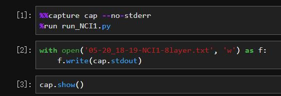

# graph_star
[](https://paperswithcode.com/sota/link-prediction-on-citeseer?p=graph-star-net-for-generalized-multi-task-1)
[](https://paperswithcode.com/sota/link-prediction-on-cora?p=graph-star-net-for-generalized-multi-task-1)
[](https://paperswithcode.com/sota/graph-classification-on-enzymes?p=graph-star-net-for-generalized-multi-task-1)
[](https://paperswithcode.com/sota/sentiment-analysis-on-imdb?p=graph-star-net-for-generalized-multi-task-1)
[](https://paperswithcode.com/sota/graph-classification-on-mutag?p=graph-star-net-for-generalized-multi-task-1)
[](https://paperswithcode.com/sota/node-classification-on-ppi?p=graph-star-net-for-generalized-multi-task-1)
[](https://paperswithcode.com/sota/graph-classification-on-proteins?p=graph-star-net-for-generalized-multi-task-1)
[](https://paperswithcode.com/sota/link-prediction-on-pubmed?p=graph-star-net-for-generalized-multi-task-1)
[](https://paperswithcode.com/sota/text-classification-on-r52?p=graph-star-net-for-generalized-multi-task-1)
[](https://paperswithcode.com/sota/text-classification-on-r8?p=graph-star-net-for-generalized-multi-task-1)
[](https://paperswithcode.com/sota/text-classification-on-20news?p=graph-star-net-for-generalized-multi-task-1)
[](https://paperswithcode.com/sota/graph-classification-on-dd?p=graph-star-net-for-generalized-multi-task-1)
[](https://paperswithcode.com/sota/text-classification-on-ohsumed?p=graph-star-net-for-generalized-multi-task-1)
[](https://paperswithcode.com/sota/sentiment-analysis-on-mr?p=graph-star-net-for-generalized-multi-task-1)
[](https://paperswithcode.com/sota/node-classification-on-cora?p=graph-star-net-for-generalized-multi-task-1)
[](https://paperswithcode.com/sota/node-classification-on-pubmed?p=graph-star-net-for-generalized-multi-task-1)
[](https://paperswithcode.com/sota/node-classification-on-citeseer?p=graph-star-net-for-generalized-multi-task-1)

## Introduction

This is a Pytorch implementation of Graphstar (graph star net) and presented here solely for the review purpose of NeurIPS 2019. All double-blinded anonymous review policies have been observed and honored.

<!--
>  Graph Star Net for Generalized Multi-Task Learning. *. NeurIPS 2019 (Submitted) [[Paper]](GraphStarNet_final_NIPS2019.pdf).
-->
Graphstar is a novel and unified graph neural net architecture which utilizes message-passing relay and attention mechanism for multiple prediction tasks, node classification, graph classification as well as link prediction. GraphStar addresses many earlier challenges facing graph neural nets and achieves non-local representation without increasing the model depth or bearing heavy computational costs. We also propose a new method to tackle topic-specific sentiment analysis based on node classification and text classification as graph classification. Our work shows that **star nodes** can learn effective graph-data representation and improve on current methods for the three tasks. Specifically, for graph classification and link prediction, GraphStar outperforms the current state-of-the-art models by 2-5% on several key benchmarks.

--------------------------------------------------------------------------------
## Datasets
All datasets in the above, respective classification tasks will be downloaded automatically when executing the script for the first time. Please note that all datasets are publicly obtained online.

The proposed model is evaluated on several popular public datasets including Cora, Citeseer, MUTAG, D&D, and etc. For different tasks, the adopted datasets are different.

- For node classification tasks, we evaluate on Cora, Citeseer, Pubmed, PPI, IMDB and etc.
- For link prediction tasks, we evaluate on Cora, Citeseer, Pubmed and etc.
- For graph classification tasks, we tested the following datasets: Enzymes, D&D, Proteins and MUTAG.
- For graph classification in text classification tasks, we evaluate on the following datasets: 20NG, R8, R52, Ohsumed and MR. Those datasets can be created following the Pytorch_geometry required format.

For more information regarding the datasets, please refer to the submitted paper.

--------------------------------------------------------------------------------
## Dependencies

 The script has been tested under Python 3.6.X and on Nvidia GPU Tesla V100 (with CUDA 9.0 and cuDNN 7 installed). For installing required python packages, please refer to the "requirements.txt".

--------------------------------------------------------------------------------
## Options
 Normally we have already provided most of the optimal value which we got during traning. So you don't have to change much. Any away, we still explain the main options here.

 ```
   --device                                     INT/STR GPU ID / Use CPU                               Default is `0`, use 'cpu' if no GPU is available
   --num_star                                   INT     Number of Star.                                Default is 1.
   --epochs                                     INT     Number of training epochs.                     Default is 2000.
   --lr                                         FLOAT   Adam learning rate.                            Default is 2e-4.
   --dropout                                    FLOAT   Dropout rate value.                            Default is 0.0.
   --coef_dropout                               FLOAT   Dropout for attention coefficients.            Default is 0.0.
   --num_layers                                 INT     Number of layers.                              Default is 6.
   --hidden                                     INT     Number of hidden units.                        Default is 1024.
   --heads                                      INT     Multi-head for Attention.                      Default is 4.
   --l2                                         FLOAT   Regularization.                                Default is 0.
   --residual                                   STR     Skip connections across attentional layer      Default is True.
   --residual_star                              STR     Skip connections across attentional star       Default is True.
   --layer_norm                                 STR     Layer normalization                            Default is True.
   --layer_norm_star                            STR     Layer normalization for star                   Default is True.
   --activation                                 STR     Activation methods                             Default is `elu`.
   --star_init_method                           STR     Star initialization method                     Default is `attn`.
   --additional_self_loop_relation_type         STR     As its name implied                            Default is True.
   --additional_node_to_star_relation_type      STR     As its name implied                            Default is True.
   --relation_score_function                    STR     Score function for relation                    Default is `DistMult`.
   --patience                                   INT     Number of patience                             Default is 100.
   --dataset                                    STR     Name of dataset                                Default is "".
 ```

--------------------------------------------------------------------------------

## Testing (Run the code)

 1) For node classification tasks (cora, citeseer and pubmed .etc), choose related script then try
 
 Prepare Imdb dataset:
 ```sh
 cd data
 wget https://ai.stanford.edu/~amaas/data/sentiment/aclImdb_v1.tar.gz && tar zxvf aclImdb_v1.tar.gz
 cd ..
 python utils/imdb_data_util.py
  ```
 
 ```sh
 python run_transductive_nc.py --dataset=cora --num_layers=2 --heads=8 --hidden=128 --dropout=0.7 --coef_dropout=0.2 --patience=50 --l2=2e-3  --lr=1e-3  
 python run_transductive_nc.py --dataset=citeseer --num_layers=2 --heads=8 --hidden=128 --dropout=0.7 --coef_dropout=0.2 --patience=50 --l2=4e-3  --lr=1e-3  
 python run_transductive_nc.py --dataset=pubmed --num_layers=2 --heads=8 --hidden=128 --dropout=0.7 --coef_dropout=0.2 --patience=50 --l2=1e-4  --lr=5e-3
 
 python run_imdb.py
 python run_ppi.py
 ```


 2) For link prediction tasks (cora, citeseer and pubmed .etc), choose related script then try
 ```sh
 python run_lp.py --dataset=pubmed --dropout=0 --hidden=512 --l2=5e-4 --num_layers=3 --cross_layer=False --patience=500
 python run_lp.py --dataset=citeseer --dropout=0 --hidden=2048 --l2=2e-4 --num_layers=3 --cross_layer=False --patience=500
 python run_lp.py --dataset=cora --dropout=0 --hidden=2048 --l2=5e-4 --num_layers=3 --cross_layer=False --patience=200
 ```


 3) For graph classification tasks (Enzymes, D&D, Proteins), choose related script then try
 ```sh
 python run_gc.py --dataset=ENZYMES --dropout=0.2 --coef_dropout=0.2 --hidden=64 --num_layers=3 --cross_layer=False --lr=5e-4 --l2=1e-4 --max_epoch=500
 python run_gc.py --dataset=PROTEINS --dropout=0.2 --coef_dropout=0.2 --hidden=512 --num_layers=3 --cross_layer=False --lr=5e-4 --l2=1e-3 --max_epoch=500
 python run_gc.py --dataset=DD --dropout=0.2 --coef_dropout=0.2 --hidden=64 --num_layers=3 --cross_layer=False --lr=5e-4 --l2=1e-3 --max_epoch=500
 python run_gc.py --dataset=MUTAG --dropout=0 --coef_dropout=0 --hidden=64 --num_layers=3 --cross_layer=False --lr=5e-4 --max_epoch=200
 ```

 4) For text classification tasks, change **DATASET** value in the script, then try
 ```sh
 python build_text_graph.py  # only need at the first time for a single dataset
 python run_text_classification.py
 ```


--------------------------------------------------------------------------------
## Plot Graph Classification Results

For graph classification tasks (D&D, Enzymes, Proteins etc.), we adopt 10-fold cross validation as metric to evaluate their performance. A script "log_plot_tools" was created to visualize their results. To use this tool, first you need to save the print out messages during training in a txt file.

If you prefer use linux terminal, you can use the **tee** command, like the following way.

```sh
 python run_mutag | tee log.txt
```


If you use JupyterHub, you can use the magic command **%capture** to server this purpose, as shown in following figure.



After got the log file, just run the command in a terminal, like:

```sh
   python log_plot_tools.py --log_dir=./log_file_name.txt \
    [ --show_plots=false  --save_as_pdf=true]
```
## Performance
### Node Classification (Transductive)
| Models  | Cora (Acc)  | Citeseer (Acc)  | Pubmed (Acc)
| :------------ | :------------ | :------------ | :------------|
| GCN  | 0.815  | 0.703  | 0.790  |
| GAT  | 0.830  | 0.725  | 0.790  |
| SGC  | 0.806  | 0.714  | 0.770  |
| MTGAE  | 0.790  | 0.718  | **0.804**  |
| LGCN  | **0.833**  | **0.730**  | 0.795  |
| **GraphStar**  | 0.821(0.012)  | 0.71(0.021)  | 0.772(0.011)  |

### Node Classification (Inductive)

| Models  | PPI (F1-Micro)  |
| :------------ | :------------ |
| GraphSage  | 0.612  |
| GAT  | 0.973  |
| LGCN  |  0.772  |
| JK-Dense LSTM  | 0.500  |
| GaAN  | 0.987  |
| **GraphStar**  | **0.994(0.001)**  |

| Models  | IMDB (Acc)  |
| :------------ | :------------ |
| oh-LSTM  | 0.941  |
| L Mixed  | 0.955  |
| BERT large finetune UDA  | 0.958  |
| **GraphStar**  | **0.960(0.001)**  |


### Graph Classification
| Models  | Enzymes  | D&D  | Proteins  | Mutag  |
| :------------ | :------------ | :------------ | :------------ | :------------ |
| Seal-Sage  | -  | **0.809**  | 0.772  | -  |
| Diff Pool  | 0.625  | 0.806  | 0.763  | -  |
| CAPS GNN  | 0.574  | 0.754  | 0.763  | 0.867  |
| **GraphStar**  | **0.671(0.0027)**  | 0.796(0.005)  | **0.779(0.008)**  | **0.912(0.021)**  |

### Graph Text Classification
| Models  | R8  | R52  | 20NG  | MR  | Ohsumed  |
| :------------ | :------------ | :------------ | :------------ | :------------ | :------------ |
| Bi-LSTM  | 0.963  | 0.905  | 0.732  | **0.777**  | 0.493  |
| fastText  | 0.961  | 0.928  | 0.794  | 0.751  | 0.557  |
| TextGCN  | 0.9707  | 0.9356  | 0.8634  | 0.7674  | 0.6836  |
| SGCN  | 0.9720  | 0.9400  | **0.8850**  | 0.7590  | **0.6850**  |
| **GraphStar**  | **0.974(0.002)**  | **0.950(0.003)**  | 0.869(0.003)  | 0.766(0.004)  | 0.642(0.006)  |

### Link Prediction
| Models  | Cora  | Citeseer  | Pubmed  |
| :------------ | :------------ | :------------ | :------------ |
| MTGAE  | 0.946  | 0.949  | 0.944  |
| VGAE  | 0.920  | 0.914  | 0.965  |
| **GraphStar**  | **0.959(0.003)**  | **0.977(0.003)**  | **0.970(0.001)**  | 

--------------------------------------------------------------------------------
<!--
## Reference
If you find this work useful for your research, please consider citing our work in following way after published.


```
@article{
  graphStar2019,
  title="{Graph Star Net for Generalized Multi-Task Learning}",
  author={**},
  journal={NeurIPS},
  year={2019}
}
```
-->
## Acknowledgement
This code is based on the Pytorch_geometry's work, so we would like to thank its contributors (Fey, Matthias and Lenssen, Jan E.) here.
